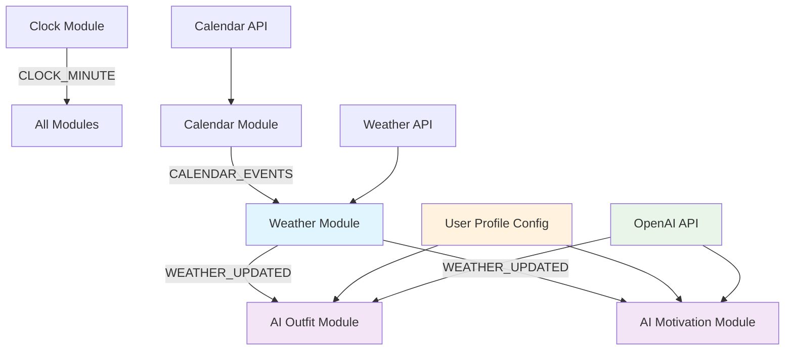
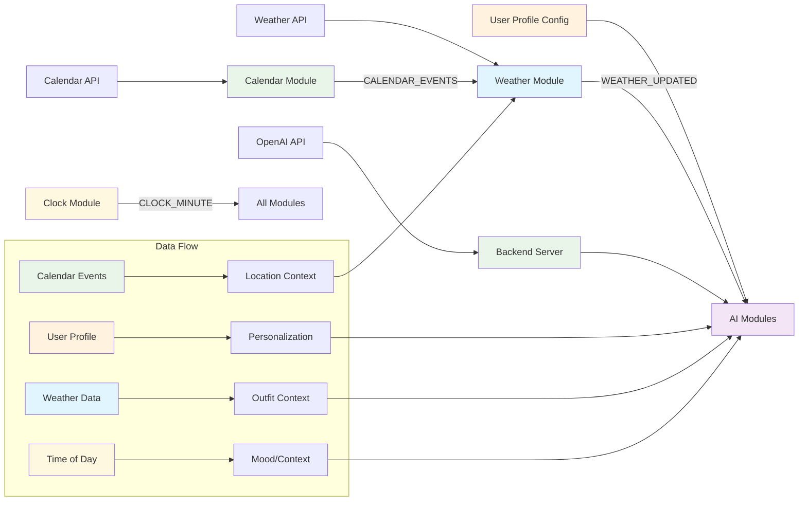
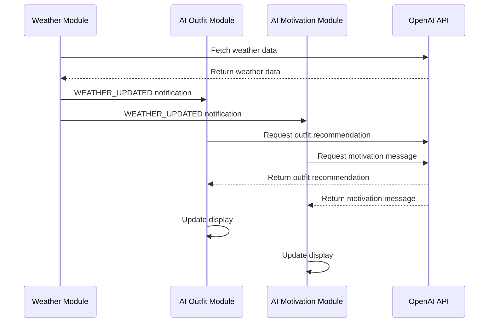
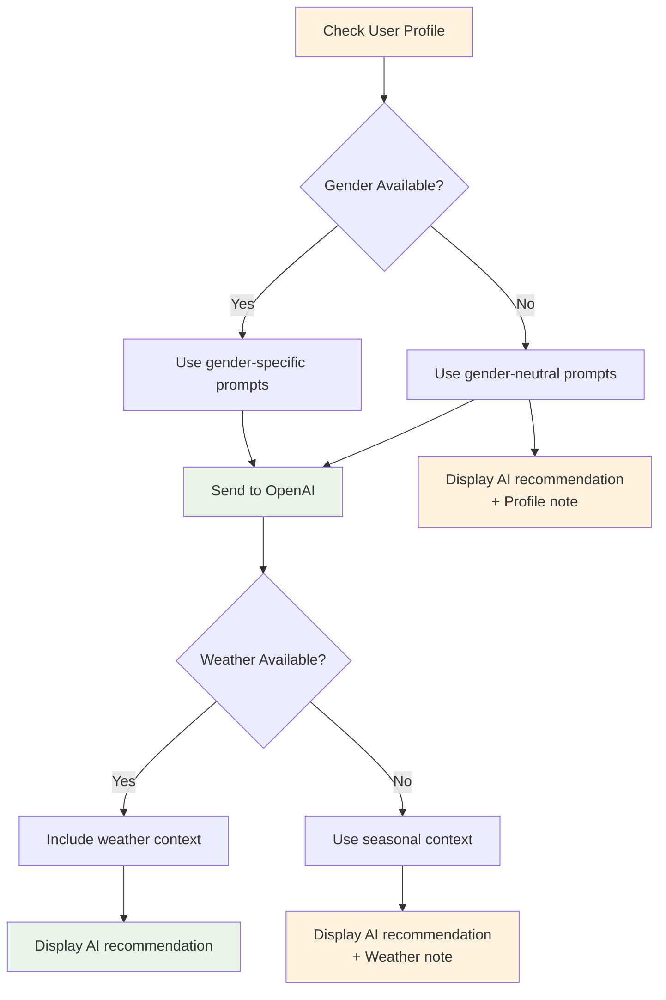
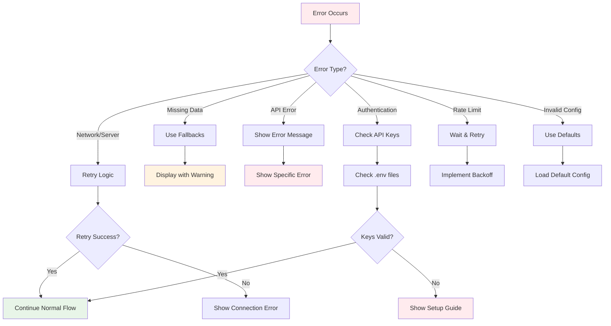
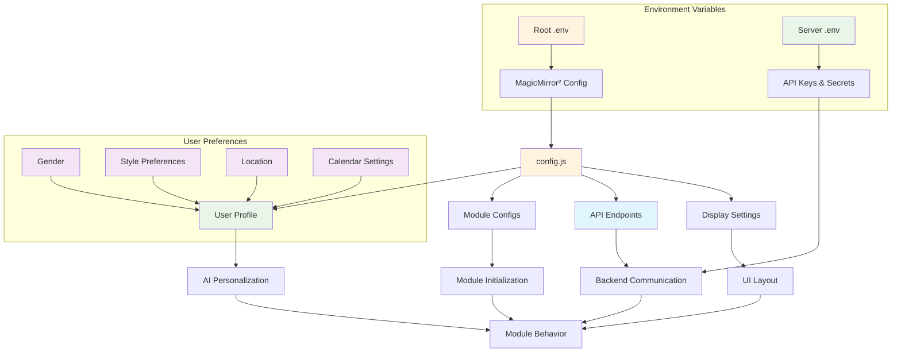
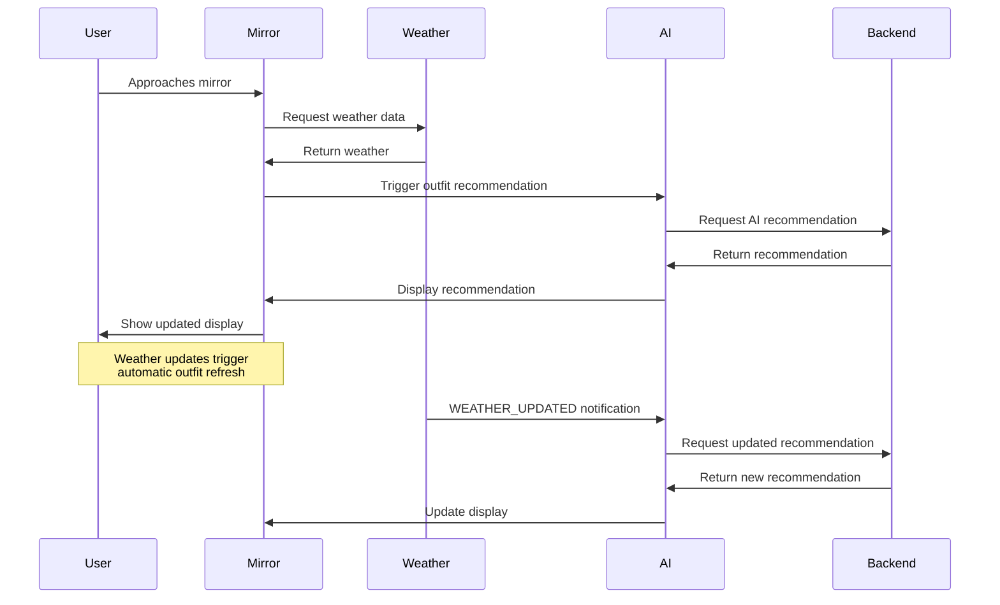
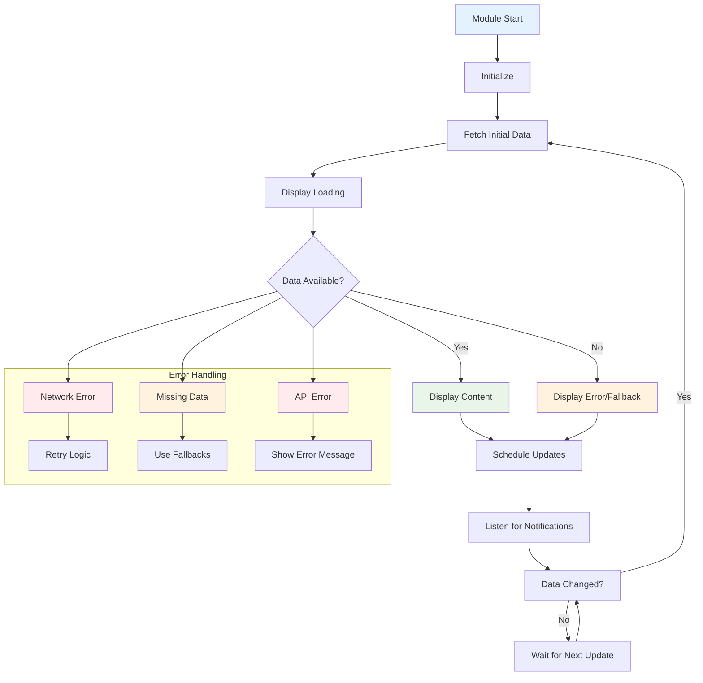

# Data Flow Architecture

## Module Communication Flow

## Module Dependency Chain

## Data Timing and Triggers

## Error Handling and Fallbacks

## Error Recovery Flow

## Configuration Flow

## User Interaction Flow

## Module Lifecycle

