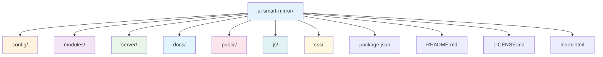
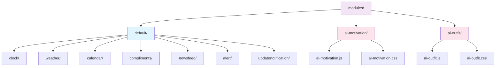
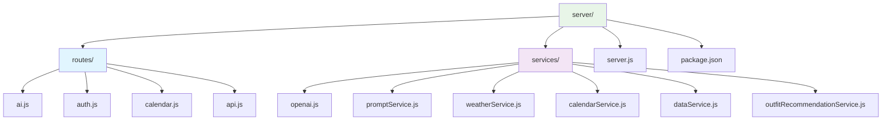
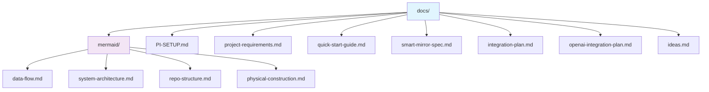
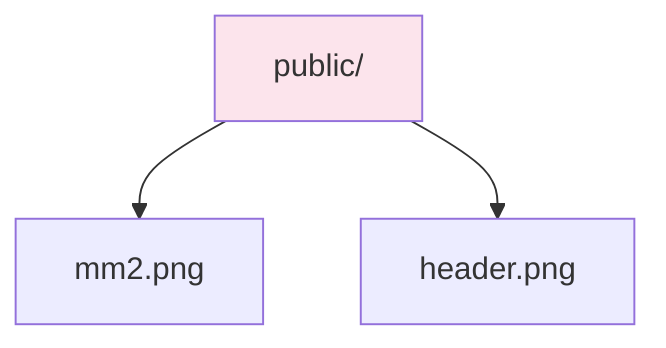

# Repository Structure

## Root Directory Structure

```mermaid
graph TD
    A[ai-smart-mirror/] --> B[config/]
    A --> C[modules/]
    A --> D[server/]
    A --> E[docs/]
    A --> F[public/]
    A --> G[js/]
    A --> H[css/]
    A --> I[package.json]
    A --> J[README.md]
    A --> K[LICENSE.md]
    A --> L[index.html]

    style A fill:#e3f2fd
    style B fill:#fff3e0
    style C fill:#f3e5f5
    style D fill:#e8f5e8
    style E fill:#e1f5fe
    style F fill:#fce4ec
    style G fill:#e0f2f1
    style H fill:#fff8e1
```

## Configuration and Core Files

```mermaid
graph TD
    A[config/] --> B1[config.js]
    A --> B2[en.json]
    A --> B3[translations.js]

    C[js/] --> C1[app.js]
    C --> C2[main.js]
    C --> C3[module.js]
    C --> C4[server.js]
    C --> C5[utils.js]
    C --> C6[logger.js]
    C --> C7[translator.js]
    C --> C8[loader.js]
    C --> C9[class.js]
    C --> C10[defaults.js]
    C --> C11[check_config.js]
    C --> C12[animateCSS.js]
    C --> C13[socketclient.js]
    C --> C14[server_functions.js]
    C --> C15[vendor.js]
    C --> C16[electron.js]
    C --> C17[deprecated.js]

    D[css/] --> D1[main.css]
    D --> D2[custom.css.sample]
    D --> D3[font-awesome.css]
    D --> D4[roboto.css]

    style A fill:#fff3e0
    style C fill:#e0f2f1
    style D fill:#fff8e1
```

## Module Structure

```mermaid
graph TD
    A[modules/] --> B[default/]
    A --> C[ai-motivation/]
    A --> D[ai-outfit/]

    B --> B1[clock/]
    B --> B2[weather/]
    B --> B3[calendar/]
    B --> B4[compliments/]
    B --> B5[newsfeed/]
    B --> B6[alert/]
    B --> B7[updatenotification/]

    C --> C1[ai-motivation.js]
    C --> C2[ai-motivation.css]

    D --> D1[ai-outfit.js]
    D --> D2[ai-outfit.css]

    style A fill:#f3e5f5
    style B fill:#e1f5fe
    style C fill:#fce4ec
    style D fill:#fce4ec
```

## Backend Server Structure

```mermaid
graph TD
    A[server/] --> B[routes/]
    A --> C[services/]
    A --> D[server.js]
    A --> E[package.json]

    B --> B1[ai.js]
    B --> B2[auth.js]
    B --> B3[calendar.js]
    B --> B4[api.js]

    C --> C1[openai.js]
    C --> C2[promptService.js]
    C --> C3[weatherService.js]
    C --> C4[calendarService.js]
    C --> C5[dataService.js]
    C --> C6[outfitRecommendationService.js]

    style A fill:#e8f5e8
    style B fill:#e1f5fe
    style C fill:#f3e5f5
```

## Documentation Structure

```mermaid
graph TD
    A[docs/] --> B[mermaid/]
    A --> C[PI-SETUP.md]
    A --> D[project-requirements.md]
    A --> E[quick-start-guide.md]
    A --> F[smart-mirror-spec.md]
    A --> G[integration-plan.md]
    A --> H[openai-integration-plan.md]
    A --> I[ideas.md]

    B --> B1[data-flow.md]
    B --> B2[system-architecture.md]
    B --> B3[repo-structure.md]
    B --> B4[physical-construction.md]

    style A fill:#e1f5fe
    style B fill:#f3e5f5
```

## Static Assets

```mermaid
graph TD
    A[public/] --> B[mm2.png]
    A --> C[header.png]

    style A fill:#fce4ec
```
