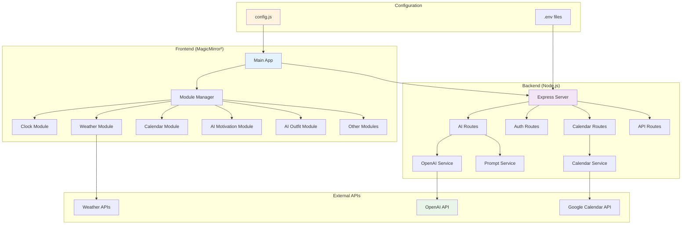
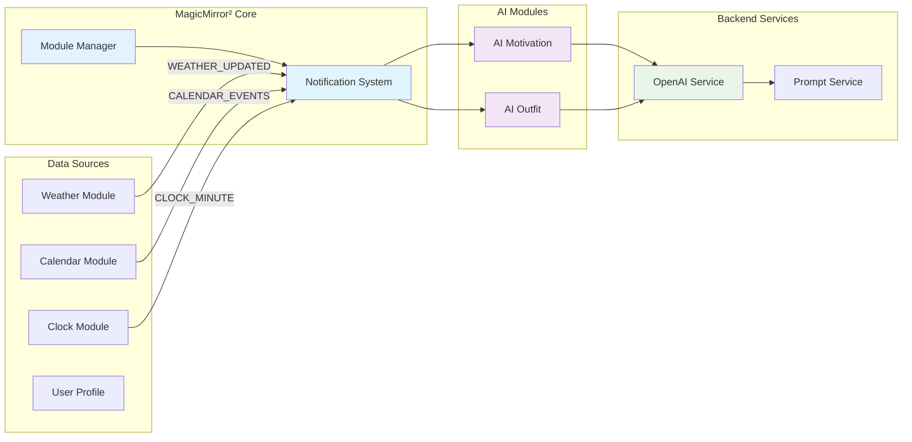
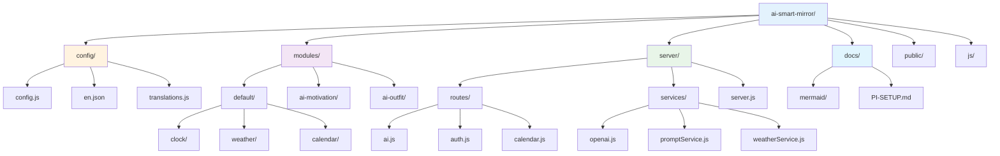

# System Architecture

## High-Level Architecture

```mermaid
graph TB
    subgraph "Frontend (MagicMirror²)"
        A[Main App] --> B[Module Manager]
        B --> C[Clock Module]
        B --> D[Weather Module]
        B --> E[Calendar Module]
        B --> F[AI Motivation Module]
        B --> G[AI Outfit Module]
        B --> H[Other Modules]
    end

    subgraph "Backend (Node.js)"
        I[Express Server] --> J[AI Routes]
        I --> K[Auth Routes]
        I --> L[Calendar Routes]
        I --> M[API Routes]
        J --> N[OpenAI Service]
        J --> O[Prompt Service]
        L --> P[Calendar Service]
    end

    subgraph "External APIs"
        Q[OpenAI API]
        R[Weather APIs]
        S[Google Calendar API]
    end

    subgraph "Configuration"
        T[config.js]
        U[.env files]
    end

    A --> I
    T --> A
    U --> I
    N --> Q
    P --> S
    D --> R

    style A fill:#e3f2fd
    style I fill:#f3e5f5
    style Q fill:#e8f5e8
    style T fill:#fff3e0
```

## Module Communication Architecture

```mermaid
graph LR
    subgraph "MagicMirror² Core"
        A[Module Manager]
        B[Notification System]
    end

    subgraph "Data Sources"
        C[Weather Module]
        D[Calendar Module]
        E[Clock Module]
        F[User Profile]
    end

    subgraph "AI Modules"
        G[AI Motivation]
        H[AI Outfit]
    end

    subgraph "Backend Services"
        I[OpenAI Service]
        J[Prompt Service]
    end

    A --> B
    C -->|WEATHER_UPDATED| B
    D -->|CALENDAR_EVENTS| B
    E -->|CLOCK_MINUTE| B
    B --> G
    B --> H
    G --> I
    H --> I
    I --> J

    style A fill:#e3f2fd
    style B fill:#e1f5fe
    style G fill:#f3e5f5
    style H fill:#f3e5f5
    style I fill:#e8f5e8
```

## File Structure Architecture

```mermaid
graph TD
    A[ai-smart-mirror/] --> B[config/]
    A --> C[modules/]
    A --> D[server/]
    A --> E[docs/]
    A --> F[public/]
    A --> G[js/]

    B --> B1[config.js]
    B --> B2[en.json]
    B --> B3[translations.js]

    C --> C1[default/]
    C --> C2[ai-motivation/]
    C --> C3[ai-outfit/]

    C1 --> C1A[clock/]
    C1 --> C1B[weather/]
    C1 --> C1C[calendar/]

    D --> D1[routes/]
    D --> D2[services/]
    D --> D3[server.js]

    D1 --> D1A[ai.js]
    D1 --> D1B[auth.js]
    D1 --> D1C[calendar.js]

    D2 --> D2A[openai.js]
    D2 --> D2B[promptService.js]
    D2 --> D2C[weatherService.js]

    E --> E1[mermaid/]
    E --> E2[PI-SETUP.md]

    style A fill:#e3f2fd
    style B fill:#fff3e0
    style C fill:#f3e5f5
    style D fill:#e8f5e8
    style E fill:#e1f5fe
```
